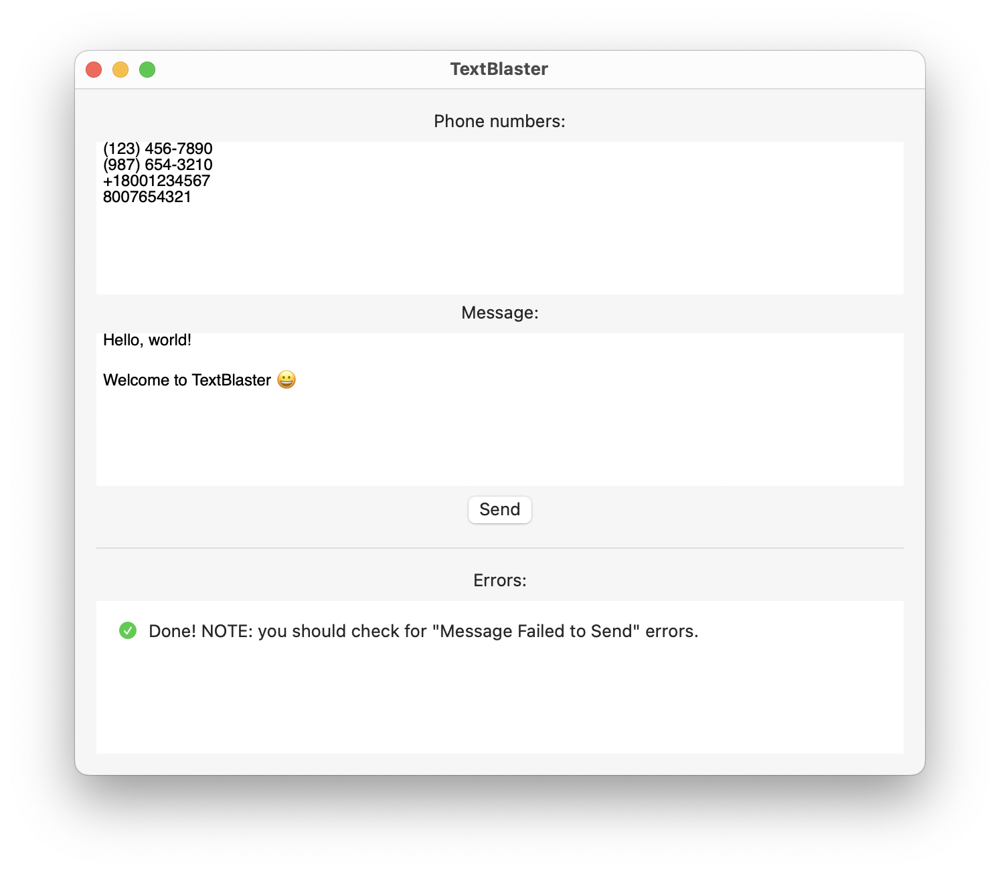

# TextBlaster

Send out a text blast using the Messages app on macOS.

If you have set up iMessage and [Text Message Forwarding](https://support.apple.com/en-us/HT208386), this will automatically send either an iMessage or SMS depending on whether the recipient's phone number is registered for iMessage.

*Requires Xcode 15 or later.*